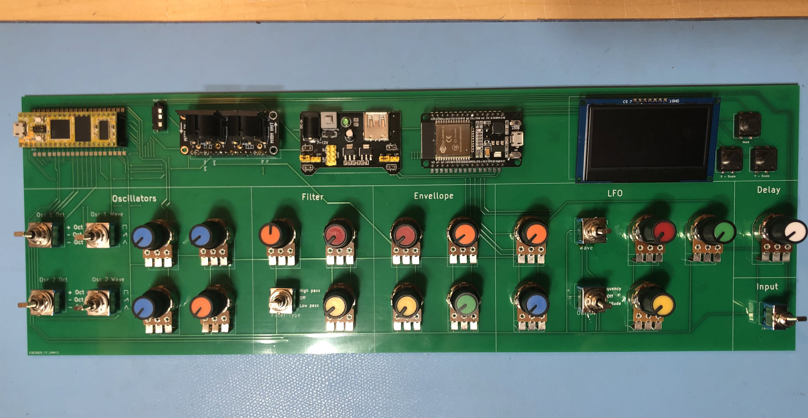

# Synthétiseur ICUS-1
#### Dans le cadre du cours 420-0SH-SW

synthétiseur créé à partir du module Daisy Seed, avec une communication série et un oscilloscope pour visualiser les effets sonores. Le projet vise à offrir une solution abordable et open source pour les amateurs de musique électronique.

Le code du synthétiseur ce trouve [ici](https://github.com/Venorrak/Synthesiser_v1/blob/Synth%C3%A9tiseur_Arduino_ver/Arduino/Synthesiser/Synthesiser.ino)

Le code pour l'oscilloscope ce trouve [ici](https://github.com/Venorrak/Synthesiser_v1/blob/Oscilloscope/Oscilloscope/oscilloscope_Light.ino)

